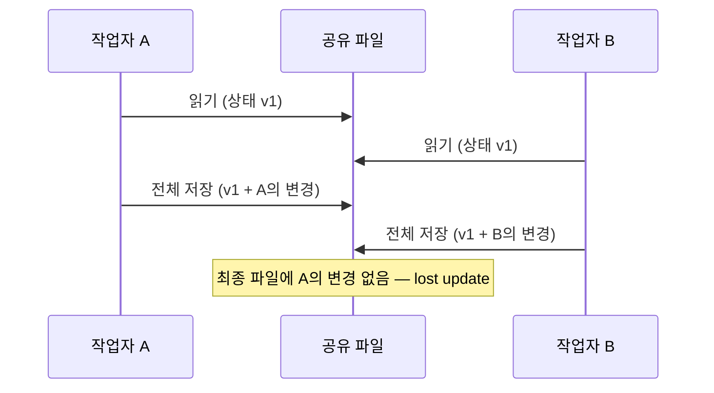
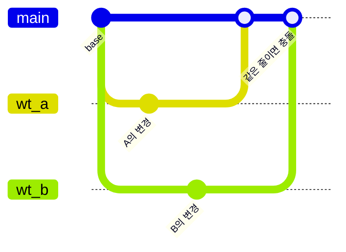
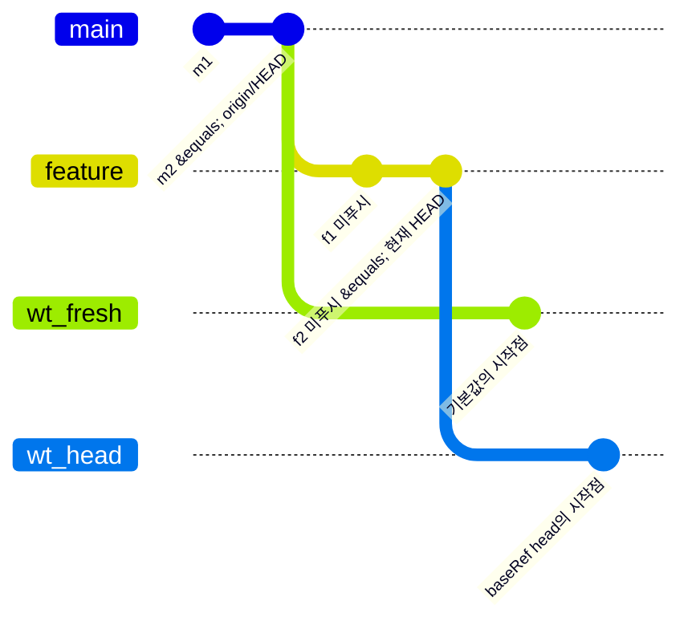
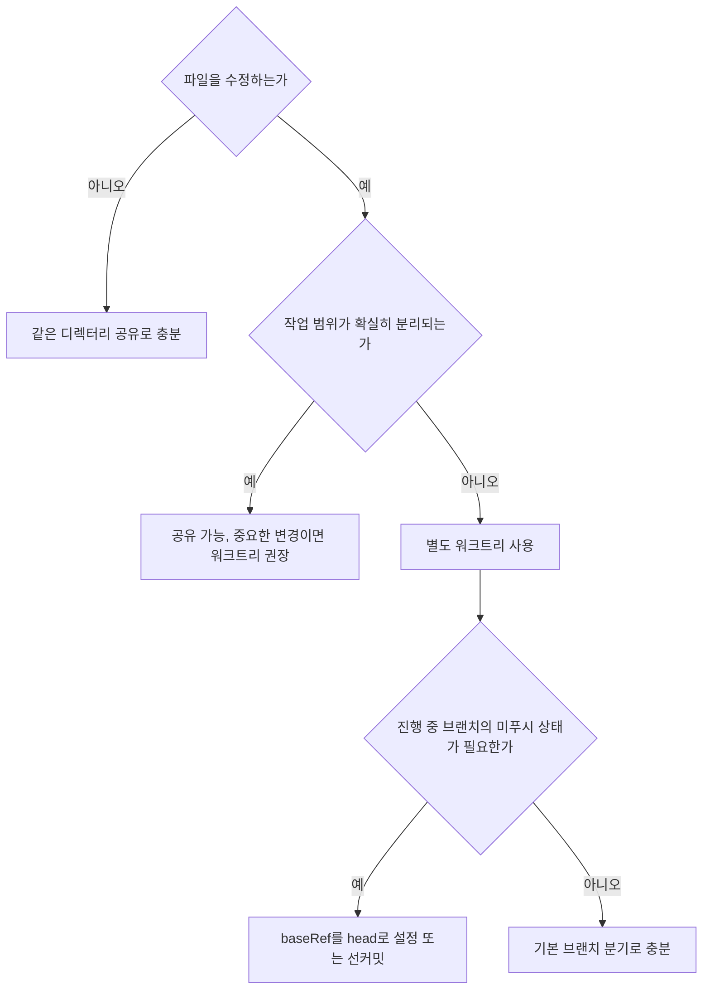

# Day 5 — 2026-07-18 (토)

- ⏱️ 공부 시간: 21:00 ~ 22:23 (84분)
- 📚 강의: 하네스 강의 — 서브에이전트·Git 워크트리

## 오늘 배운 것 — Claude Code의 서브에이전트와 Git Worktree

> 병렬 실행과 파일 격리는 어떻게 다른가

## TL;DR

* **서브에이전트**는 작업 주체를 분리한다. 자체 컨텍스트 창·시스템 프롬프트·도구 권한을 가진다.
* **병렬 실행**은 작업 시간을 겹치게 한다. 서브에이전트는 순차로도, 병렬로도 돌 수 있다.
* **워크트리**는 파일 상태를 분리한다. 작업 중 직접 덮어쓰기는 막지만, 통합 시 Git 병합 충돌은 남는다.
* Claude Code 워크트리는 현재 `HEAD`가 아니라 **기본 브랜치(`origin/HEAD`)에서 분기하는 것이 기본값**이다. 진행 중 작업 위에서 격리하려면 `worktree.baseRef: "head"`가 필요하다.
* 기본 구현은 Git의 네이티브 `git worktree`이고, Claude Code는 그 위에 생성·전환·정리 자동화를 얹는다.

---

## 1. 세 개의 축

작업 주체가 분리되어 있는가, 동시에 실행되는가, 파일 작업공간이 분리되어 있는가는 서로 독립적인 질문이다. 서브에이전트를 하나씩 호출하면 순차 실행이고, 여러 개를 동시에 돌려도 별도 설정이 없으면 같은 디렉터리를 공유하며, `--worktree` 세션을 하나만 띄우면 격리는 되지만 병렬은 아니다.

| 실행 형태                          | 독립 컨텍스트 | 동시 실행 가능 | 기본 파일 작업공간    | 작업 중 직접 간섭 |  통합 시 병합 충돌 |
| ------------------------------ | ------: | -------: | ------------- | ---------: | ----------: |
| 메인 에이전트만 실행                    |   해당 없음 |        X | 메인 작업 디렉터리    |      해당 없음 |       해당 없음 |
| 서브에이전트 한 개 호출                  |       O |    필수 아님 | 메인과 공유        |         가능 | 별도 병합 단계 없음 |
| 여러 서브에이전트 병렬 실행                |    각각 O |        O | 기본적으로 메인과 공유  |         가능 | 별도 병합 단계 없음 |
| 서브에이전트 + `isolation: worktree` |    각각 O |        O | 각각 별도 워크트리    |        방지됨 |          가능 |
| 여러 `--worktree` 세션 동시 실행       |   세션별 O |        O | 세션별 별도 워크트리   |        방지됨 |          가능 |
| 백그라운드 세션                       |   세션별 O |        O | 기본적으로 별도 워크트리 |        방지됨 |          가능 |

---

## 2. 왜 파일 격리가 필요한가

두 작업자가 같은 디렉터리에서 같은 파일을 수정하면 하나의 파일 상태를 공유한다. 둘 다 같은 이전 상태를 읽은 뒤 각자 파일 전체를 저장하면, 나중에 저장한 쪽이 앞선 변경을 포함하지 않은 파일을 기록해 **lost update**가 생길 수 있다. 스크래치 저장소에서 이 방식을 재현하면 실제로 앞선 변경이 아무 경고 없이 유실된다.



다만 항상 그렇게 되는 것은 아니다. 편집 도구와 변경 위치에 따라 두 변경이 병존하기도, 두 번째 편집이 실패하기도, 조용히 유실되기도 한다. Claude Code의 Edit 계열 도구는 특정 문자열을 대상으로 치환하므로 전체 덮어쓰기보다 안전한 편이지만, 여러 작업자가 같은 파일 상태를 공유한다는 사실은 변하지 않는다. 같은 파일이나 인접 코드를 병렬 수정하면 간섭 가능성이 생긴다.

---

## 3. 워크트리가 해결하는 것과 해결하지 않는 것

워크트리를 쓰면 각 작업자는 경로가 같아도 물리적으로 다른 디렉터리의 파일을 다룬다. 미커밋 변경과 untracked 파일이 서로에게 보이지 않고, 같은 working tree와 index를 공유하며 생기는 직접 간섭이 사라진다.

대신 통합 단계는 남는다. 같은 줄을 고쳤다면 Git이 병합 충돌을 보고하고, 자동 병합되더라도 의미적 충돌(삭제된 함수를 다른 쪽이 호출, 합친 뒤에만 깨지는 테스트, 같은 버전 번호를 쓰는 마이그레이션 등)은 생길 수 있다. 별도 워크트리로 재현한 데모에서도 두 변경은 각자 보존되었고, 같은 부분을 수정한 경우는 병합에서 충돌로 드러났다.

> 워크트리는 충돌을 제거하는 게 아니라, 작업 중 직접적인 파일 간섭을 막고 변경 통합을 Git의 명시적인 병합 단계로 옮긴다.



| 구분         | 같은 작업 디렉터리 공유      | 별도 워크트리           |
| ---------- | ------------------ | ----------------- |
| 작업 중 파일 상태 | 모든 작업자가 공유         | 작업자별로 분리          |
| 직접 덮어쓰기    | 가능                 | 방지됨               |
| 미커밋 변경 노출  | 다른 작업에 보일 수 있음     | 서로 보이지 않음         |
| 변경 통합      | 암묵적으로 섞일 수 있음      | Git 병합으로 명시적으로 수행 |
| 병합 충돌 감지   | 명확한 통합 단계가 없을 수 있음 | Git이 충돌을 보고       |
| 의미적 충돌     | 가능                 | 통합 후에도 가능         |

---

## 4. 언제 워크트리가 쓰이는가

항상 쓰이는 것은 아니다.

### 4.1 일반 서브에이전트

서브에이전트는 기본적으로 메인 대화의 현재 작업 디렉터리에서 시작하고, 부모와 같은 파일 상태를 공유한다. 격리를 보장하려면 frontmatter에 지정하거나,

```yaml
---
name: frontend-worker
description: 프론트엔드 작업 담당
isolation: worktree
---
```

대화에서 요청한다(“각 작업을 별도의 워크트리로 격리해서 병렬로 실행해줘”). 이때 Claude는 `EnterWorktree` 도구로 워크트리를 만들거나 이동한다. Claude가 상황을 보고 알아서 워크트리를 선택할 수도 있지만, 보장된 기본 동작은 아니다.

주의: `isolation: worktree`로 만든 워크트리는 부모 세션의 `HEAD`가 아니라 기본 브랜치에서 분기하는 것이 기본값이다(4.5 참고).

### 4.2 `--worktree` 세션

```bash
claude --worktree feature-auth   # 축약형 -w
```

저장소 루트의 `.claude/worktrees/<이름>/`에 워크트리가 생기고 `worktree-<이름>` 브랜치가 만들어져 체크아웃된다. 이 명령 하나로는 격리 세션 하나일 뿐이며, 병렬 작업을 하려면 터미널마다 각각 실행해야 한다.

### 4.3 데스크톱 앱

Git 저장소에서 새 세션마다 워크트리를 자동 생성해 세션 간 파일 상태를 격리한다. Git worktree가 기본 구현이므로 Git 저장소를 전제로 한다.

### 4.4 백그라운드 세션

Git 저장소라면 파일 편집 전에 `.claude/worktrees/` 아래 격리 워크트리로 이동하는 것이 기본이다. 예외는 네 가지다: 이미 linked worktree 안에서 세션을 시작한 경우, Git 저장소가 아니고 Worktree 훅도 없는 경우, 작업 디렉터리 외부 파일을 수정하는 경우, `worktree.bgIsolation: "none"`으로 격리를 끈 경우.

워크트리로 격리한 백그라운드 세션은 작업을 마치면 스스로 커밋하고 자체 브랜치를 푸시한 뒤 **드래프트 PR을 연다**. `main`/`master` 푸시나 강제 푸시, 머지는 하지 않으며, PR을 열지 말라고 지시했거나 리모트가 없으면 생략한다. 반대로 스스로 격리하지 않은 체크아웃에서는 커밋이나 브랜치 전환 전에 묻는다. 즉 백그라운드 세션의 결과 통합은 로컬 병합보다 PR 리뷰 형태로 나타나는 경우가 많다.

### 4.5 어디에서 분기하는가

Claude Code가 만드는 워크트리는 현재 `HEAD`가 아니라 **저장소의 기본 브랜치(`origin/HEAD`)에서 분기하는 것이 기본값**이다. 최근 fetch가 없으면 기본 브랜치를 짧게 갱신 시도하고, 리모트가 없거나 `origin/HEAD`를 확인할 수 없으면 로컬 `HEAD`로 폴백한다. 이 규칙은 `--worktree`와 `isolation: worktree` 모두에 적용된다.

따라서 기본 설정의 워크트리에는 현재 브랜치의 미푸시 커밋과 진행 중 상태가 없다. 진행 중 작업 위에서 격리하려면 `worktree.baseRef`를 `"head"`로 설정한다. 값은 `"fresh"`(기본)와 `"head"`만 허용되며, linked worktree 안에서 실행 중이라면 `"head"`는 그 워크트리의 `HEAD`를 가리킨다.



그 밖에 두 가지: `claude --worktree "#1234"`는 `pull/<번호>/head`를 가져와 `.claude/worktrees/pr-<번호>`에 워크트리를 만든다. 기존 이름을 재사용하면 그 워크트리를 재개하되, 미커밋·미추적 변경이 없고 생성된 브랜치 그대로이며 커밋한 적이 없거나 PR이 병합되어 원격 브랜치가 삭제된 경우에는 현재 베이스로 리셋된다.

---

## 5. 실제 사례: `songpa_connect`

`develop` 브랜치에서 `git worktree list`를 실행한 결과:

```text
.../songpa_connect                                      [develop]
.../songpa_connect/.claude/worktrees/hungry-cori-...    (detached HEAD)
.../songpa_connect/.claude/worktrees/trusting-...       (detached HEAD)
```

확인된 사실: Claude Code가 관리하는 경로에 격리된 worktree들이 존재했고, 병렬 작업들은 메인 working tree를 공유하지 않고 각자의 파일 상태에서 수행되었다. 확정할 수 없는 것: 어떤 경로(`isolation: worktree`, 백그라운드 세션, 데스크톱, 명시적 요청, Claude의 선택)가 이 워크트리들을 만들었는지는 당시 실행 기록 없이 알 수 없다.

detached HEAD도 일반 규칙이 아니라 이 저장소에서 관찰된 상태다. 현행 문서 기준으로 `--worktree`는 `worktree-<이름>` 브랜치를 만들어 체크아웃하므로, 관찰된 detached HEAD는 서브에이전트·백그라운드용 임시 워크트리이거나 이전 버전의 동작일 가능성이 높다.

---

## 6. 기술 베이스는 `git worktree`

Git worktree는 저장소를 복제하지 않는다. 하나의 저장소가 객체와 히스토리를 공유하면서 여러 개의 working tree를 갖는다.

linked worktree의 `.git`은 디렉터리가 아니라 전용 Git 디렉터리를 가리키는 포인터 파일이다.

```bash
$ cat wt-demo/.git
gitdir: /.../worktree-demo/.git/worktrees/wt-demo
```

상태는 워크트리별과 저장소 공통으로 나뉜다.

```text
git-dir (워크트리별)           git-common-dir (저장소 공통)
├── HEAD                      ├── objects
├── index                     ├── 대부분의 refs
└── 대부분의 pseudo-ref 등     ├── 기본 repository config
                              └── remote 정보 등
```

커밋·트리·blob 객체는 공유되므로 `git clone`을 여러 번 하는 것보다 가볍다. 엄밀하게는 일부 refs가 워크트리별로 관리되고, `extensions.worktreeConfig`를 쓰면 설정도 `config.worktree`로 워크트리별 분리가 가능하다. 다만 체크아웃 자체의 비용(파일 생성, 의존성 설치, 빌드 산출물, 로컬 설정 복사, IDE 인덱싱)은 워크트리마다 든다.

---

## 7. 비-Git 환경

기본 구현이 `git worktree`이므로 그대로 쓰려면 Git 저장소여야 한다. SVN, Perforce, Mercurial 등에서는 `WorktreeCreate`와 `WorktreeRemove` 훅으로 별도 체크아웃 디렉터리의 생성과 정리를 직접 구현해 대체할 수 있다. 단, 훅을 쓰면 기본 git 로직이 통째로 대체되어 `.worktreeinclude`가 처리되지 않으므로, `.env` 같은 로컬 파일 복사도 훅 스크립트 안에서 수행해야 한다.

---

## 8. 단정하면 안 되는 것들

본문의 동작 설명은 공식 문서로 확인한 내용이다. 반대로 다음은 관찰·추론 수준으로만 말해야 한다.

1. **Claude가 요청 없이 항상 워크트리를 선택한다** — 보장되지 않는다. 확실한 격리는 직접 요청하거나 `isolation: worktree`로 지정한다.
2. **`songpa_connect` 워크트리의 정확한 생성 주체** — 결과만 확인됐고, 트리거는 당시 기록 없이 확정할 수 없다.
3. **워크트리는 항상 detached HEAD다** — 관찰된 상태일 뿐이다. `--worktree`는 브랜치를 만든다.
4. **같은 디렉터리 동시 편집이면 항상 조용한 유실이 난다** — 가능한 실패 유형 중 하나일 뿐, 도구와 변경 위치에 따라 결과가 다르다.
5. **워크트리면 충돌이 사라진다** — 직접 간섭만 막고, 병합 충돌과 의미적 충돌은 남는다.

---

## 9. 실무 치트시트

### 워크트리 세션 시작

```bash
claude --worktree feature-auth   # 이름 지정 (축약형 -w)
claude --worktree                # 이름 자동 생성
claude --worktree "#1234"        # GitHub PR에서 워크트리 생성
```

대화형에서 처음 쓰기 전에는 해당 디렉터리에서 `claude`를 한 번 실행해 신뢰 확인을 통과해야 한다. 병렬 작업은 터미널마다 각각 실행한다.

### 진행 중 작업 위에서 격리

```json
{ "worktree": { "baseRef": "head" } }
```

`--worktree`와 `isolation: worktree` 모두에 적용된다. 설정 대신 병렬 시작 전에 선커밋해 두는 방법도 있다.

### 수동 관리 (순수 Git)

```bash
git worktree add ../proj-feature -b feature-a   # 새 브랜치로 생성
git worktree add ../proj-hotfix hotfix          # 기존 브랜치 체크아웃
git worktree list
git worktree remove ../proj-feature             # 변경이 남았으면 --force
git worktree prune                              # 잔여 등록 정보 정리
```

### 로컬 파일

`.gitignore`에 `.claude/worktrees/`를 추가해 메인 작업트리에서 untracked로 보이지 않게 한다. gitignore된 `.env` 등을 새 워크트리에 복사하려면 프로젝트 루트에 `.worktreeinclude`를 둔다(gitignore 문법, 패턴 일치이면서 gitignore된 파일만 복사됨).

```gitignore
.env
.env.local
config/local.yml
```

비밀값 파일은 복사 범위와 권한을 신중히 관리한다.

### 정리 시 주의

지우기 전에 `git -C <경로> status`와 `git -C <경로> log --oneline -5`로 확인하고, 필요한 변경은 커밋, 패치, cherry-pick, stash 등으로 먼저 보존한다. Claude Code의 자동 동작도 알아 둔다.

* 에이전트 실행 중에는 워크트리가 `git worktree lock`으로 잠겨 있고, 종료 시 해제된다.
* 서브에이전트·백그라운드용 워크트리는 `cleanupPeriodDays` 경과에 미커밋·미추적·미푸시 변경이 없을 때만 자동 청소된다. `--worktree`로 직접 만든 것은 대상이 아니다.
* agent view에서 세션을 삭제하면(`Ctrl+X` 두 번) 워크트리가 미커밋 변경까지 함께 삭제된다. `claude rm`은 미커밋 변경이 있으면 유지하고, 미푸시 커밋이 있는 워크트리는 어느 경로로도 삭제되지 않는다.

---

## 10. 실무 선택 기준

* **읽기 전용 조사**(모듈별 코드 분석, 테스트 실패 원인 조사, 취약점 탐색): 같은 디렉터리 공유로 충분하다.
* **완전히 다른 파일 수정**(README, 독립된 테스트 파일, 별도 문서 디렉터리): 공유해도 되지만, 범위가 예상보다 겹칠 수 있어 중요한 변경이면 워크트리가 안전하다.
* **같은 코드 영역 병렬 수정**(같은 서비스 클래스, 리팩터링과 기능 추가 동시 진행, 공통 설정·의존성 파일 변경): 별도 워크트리를 쓰고, 최종 병합은 사람이 검토한다. 진행 중 브랜치의 미푸시 상태 위에서 해야 한다면 `baseRef: "head"` 설정이나 선커밋이 필요하다(4.5 참고).


